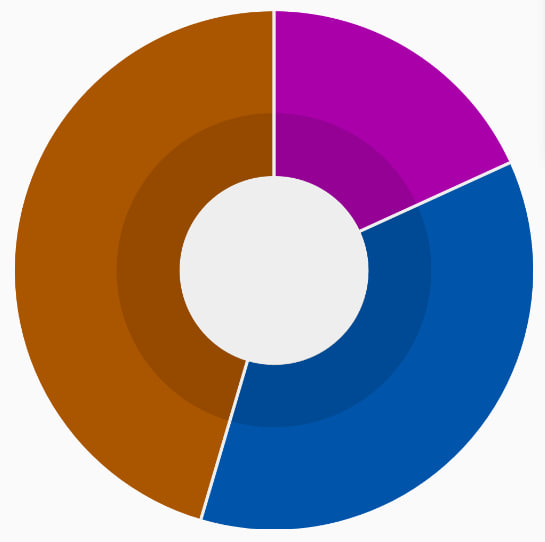
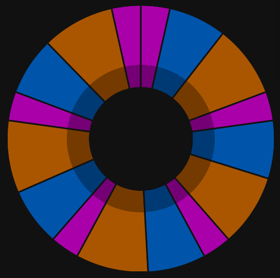

# Pie chart

Bare React Native pie chart

### Example of components with default properties



```tsx
import PieChart from './PieChart/PieChart';

const data = [
  {value: 2, color: '#a0a'},
  {value: 4, color: '#05a'},
  {value: 5, color: '#a50'},
];

<PieChart data={data} />;
```

### Usage

Requires `react-native-pie-chart` and `react-native-svg`

```
npm i react-native-pie-chart
npm i react-native-svg
```

### Properties

| Property         | Type     | Required | Description                                                  |
| ---------------- | -------- | -------- | ------------------------------------------------------------ |
| data             | Object[] | Yes      | Data to render. Use [{value:number, color:string}] type      |
| backgroundColor  | string   | No       | Color for background and dividers                            |
| outterChartWidth | number   | No       | Width of outter chart circle. Use 0-1 format. Default is 0.4 |
| innerChartWidth  | number   | No       | Width of inner chart circle. Use 0-1 format. Default is 0.4  |
| dividerWidth     | number   | No       | Width for dividers between cart sections                     |
| shadowColor      | string   | No       | Color for inner shadowed sections. Default is #00000020      |
| componentWidth   | number   | No       | The size of the component                                    |

### Example of using all styles properties



```tsx
const data = [
  {value: 2, color: '#a0a'},
  {value: 4, color: '#05a'},
  {value: 5, color: '#a50'},
  {value: 2, color: '#a0a'},
  {value: 4, color: '#05a'},
  {value: 5, color: '#a50'},
  {value: 2, color: '#a0a'},
  {value: 4, color: '#05a'},
  {value: 5, color: '#a50'},
  {value: 2, color: '#a0a'},
  {value: 4, color: '#05a'},
  {value: 5, color: '#a50'},
  {value: 2, color: '#a0a'},
  {value: 4, color: '#05a'},
  {value: 5, color: '#a50'},
  {value: 2, color: '#a0a'},
];

<PieChart
  data={data}
  backgroundColor="#111"
  outterChartWidth={0.45}
  innerChartWidth={0.3}
  dividerWidth={2}
  shadowColor="#00000050"
  componentWidth={width * 0.9}
/>;
```
