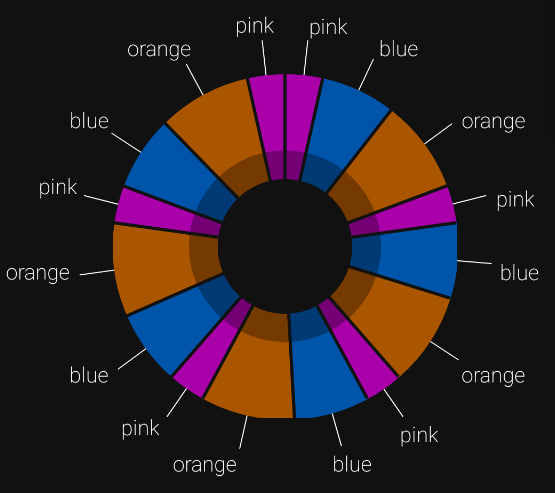

# Pie chart

Bare React Native pie chart

### Example of component with default properties


```tsx
import PieChart from './PieChart/PieChart';

const data = [
  {value: 2, color: '#a0a'},
  {value: 4, color: '#05a'},
  {value: 5, color: '#a50'},
];

<PieChart data={data} />;
```

### Usage

Requires `react-native-pie-chart` and `react-native-svg`

```
npm i react-native-pie-chart
npm i react-native-svg
```

### Properties

| Property         | Type     | Required | Description                                                  |
| ---------------- | -------- | -------- | ------------------------------------------------------------ |
| data             | Object[] | Yes      | Data to render. Use [{value:number, color:string}] type      |
| backgroundColor  | string   | No       | Color for background and dividers                            |
| outterChartWidth | number   | No       | Width of outter chart circle. Use 0-1 format. Default is 0.4 |
| innerChartWidth  | number   | No       | Width of inner chart circle. Use 0-1 format. Default is 0.4  |
| dividerWidth     | number   | No       | Width for dividers between cart sections                     |
| shadowColor      | string   | No       | Color for inner shadowed sections. Default is #00000020      |
| componentWidth   | number   | No       | The size of the component                                    |
| titles           | boolean  | No       | Whow section titls                                           |
| titleLineWidth   | number   | No       | Width of line that point to the title of section             |
| titleLineColor   | string   | No       | Color of line that point to the title of section             |
| titleStyles      | Object   | No       | Styles that will be propagated to the title of section       |

### Example using titles


```tsx
const data = [
  {value: 2, color: '#a0a', title: 'pink'},
  {value: 4, color: '#05a', title: 'blue'},
  {value: 5, color: '#a50', title: 'orange'},
];

<PieChart data={data} componentWidth={width * 0.6} titles={true} />;
```

### Example of using all styles properties


```tsx
const data = [
  {value: 2, color: '#a0a'},
  {value: 4, color: '#05a'},
  {value: 5, color: '#a50'},
  {value: 2, color: '#a0a'},
  {value: 4, color: '#05a'},
  {value: 5, color: '#a50'},
  {value: 2, color: '#a0a'},
  {value: 4, color: '#05a'},
  {value: 5, color: '#a50'},
  {value: 2, color: '#a0a'},
  {value: 4, color: '#05a'},
  {value: 5, color: '#a50'},
  {value: 2, color: '#a0a'},
  {value: 4, color: '#05a'},
  {value: 5, color: '#a50'},
  {value: 2, color: '#a0a'},
];

<PieChart
  data={data}
  backgroundColor="#111"
  outterChartWidth={0.45}
  innerChartWidth={0.3}
  dividerWidth={2}
  shadowColor="#00000050"
  componentWidth={width * 0.9}
/>;
```

### Example of using all styles properties and titles



```tsx
const data = [
  {value: 2, color: '#a0a', title: 'pink'},
  {value: 4, color: '#05a', title: 'blue'},
  {value: 5, color: '#a50', title: 'orange'},
  {value: 2, color: '#a0a', title: 'pink'},
  {value: 4, color: '#05a', title: 'blue'},
  {value: 5, color: '#a50', title: 'orange'},
  {value: 2, color: '#a0a', title: 'pink'},
  {value: 4, color: '#05a', title: 'blue'},
  {value: 5, color: '#a50', title: 'orange'},
  {value: 2, color: '#a0a', title: 'pink'},
  {value: 4, color: '#05a', title: 'blue'},
  {value: 5, color: '#a50', title: 'orange'},
  {value: 2, color: '#a0a', title: 'pink'},
  {value: 4, color: '#05a', title: 'blue'},
  {value: 5, color: '#a50', title: 'orange'},
  {value: 2, color: '#a0a', title: 'pink'},
];

<PieChart
  data={data}
  backgroundColor="#111"
  outterChartWidth={0.45}
  innerChartWidth={0.3}
  dividerWidth={2}
  shadowColor="#00000050"
  componentWidth={width * 0.6}
  titles={true}
  titleLineColor="#FFF"
  titleLineWidth={1}
  titleStyles={{color: '#fff', fontWeight: '200'}}
/>;
```
